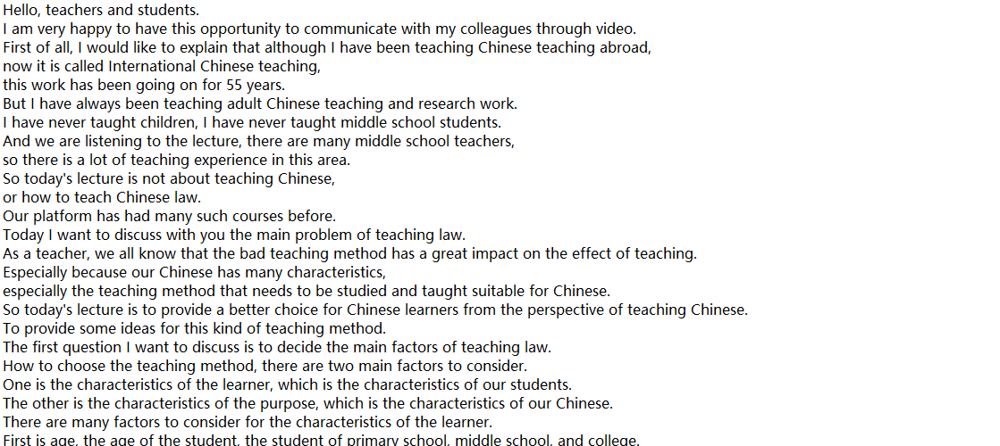
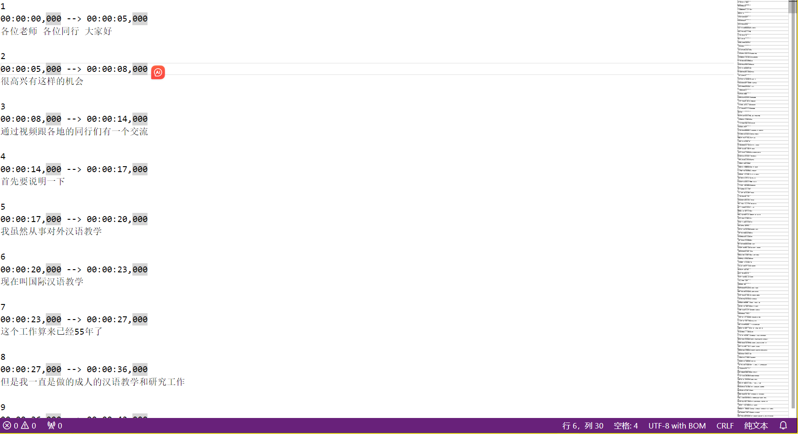
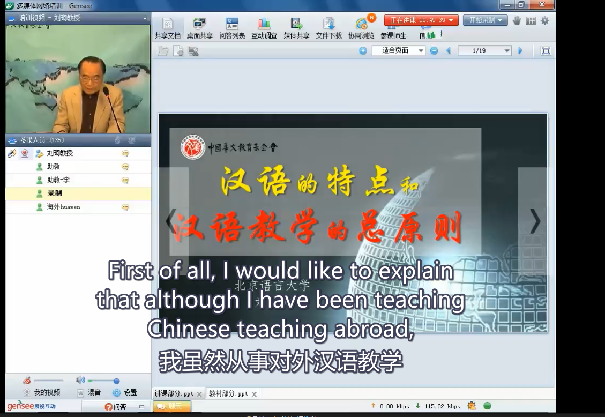

# 开发文档

## 主要目标

1. 提供视频学习资源。
2. 提供字幕翻译功能。

## 视频存储问题

- 暂时开发阶将所有文件挡在demo的bucket中
- 部署的时候考虑修改两类视频位于不同的桶中

## 视频翻译功能的调研

关于如何添加字幕和对字幕进行翻译的调研

- whisper：https://github.com/openai/whisper
- faster-whisper: https://github.com/guillaumekln/faster-whisper

第三方软件:

暂时没有找到比较好的免费的产品

目前采用openAI开源的whisper：https://github.com/Const-me/Whisper

提取视频字幕效果如下:

**txt文件格式**

**Text with timestamps**

**Translate**

**SRT文件格式**

发现再翻译的结果中，对于长视频的支持并不是很好，只翻译到了20分钟左右的样子

中文提取还行 --> 所以可以采用谷歌翻译成英文srt字幕文件再进行插入。 

将翻译填入视频

- 参考：[如何使用SRT字幕？如何导入字幕到视频中？ - 知乎 (zhihu.com)](https://zhuanlan.zhihu.com/p/85777092)

**PR2023或许能行**

- [PR 2023支持一键语音转字幕功能了！剪辑效率瞬间拉满_哔哩哔哩_bilibili](https://www.bilibili.com/video/BV1s841157j1/?spm_id_from=333.788.recommend_more_video.1&vd_source=31ce8445f20f6ea89c3ec2139321a62b)

##  测试效果

**ArcTime**

**PR**

暂时并没有时间去做测试

## 进度

目前主要是完成了两类视频的添加和展示功能

关于是否需要用户登录，待定参考